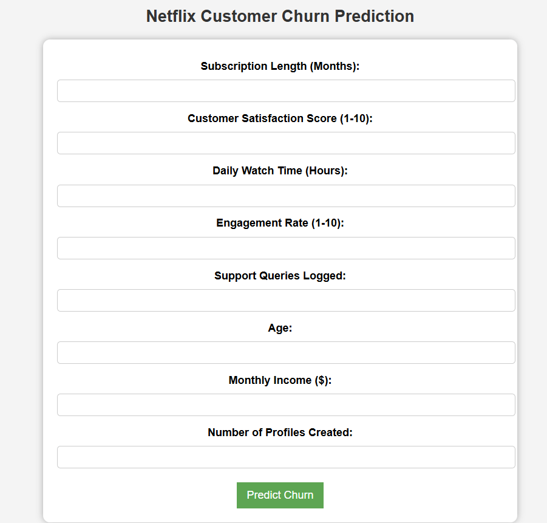

### This is a Netflix Customer churn prediction model

This project predicts **customer churn** for Netflix users using **Machine Learning (ML)** and a **Flask-based web application**. The model is trained on user activity data and provides real-time predictions via a web interface and API.

## Features
- Supports **Logistic Regression, Random Forest, Decision Tree, Ridge, and Lasso** models.
- API & Web-based predictions using **Flask**.
- Data preprocessing with **Pandas, Scikit-learn, and SMOTE** for handling imbalanced data.
- Deployment-ready on **AWS EC2**.

---

## Installation Guide

### **Clone the Repository**
```bash
git clone https://github.com/saivarma97/Netflix_customer_churn.git
cd Netflix_customer_churn
```

### Set Up a Virtual Environment
```
python3 -m venv venv
source venv/bin/activate  # On Windows use `venv\Scripts\activate`
```

### Install Dependecies
```
pip install -r requirements.txt
```
### Start the Flask Server and click on the URL appreared
```
python app.py

```
# Here is the Landing page where user needs to enter the data
